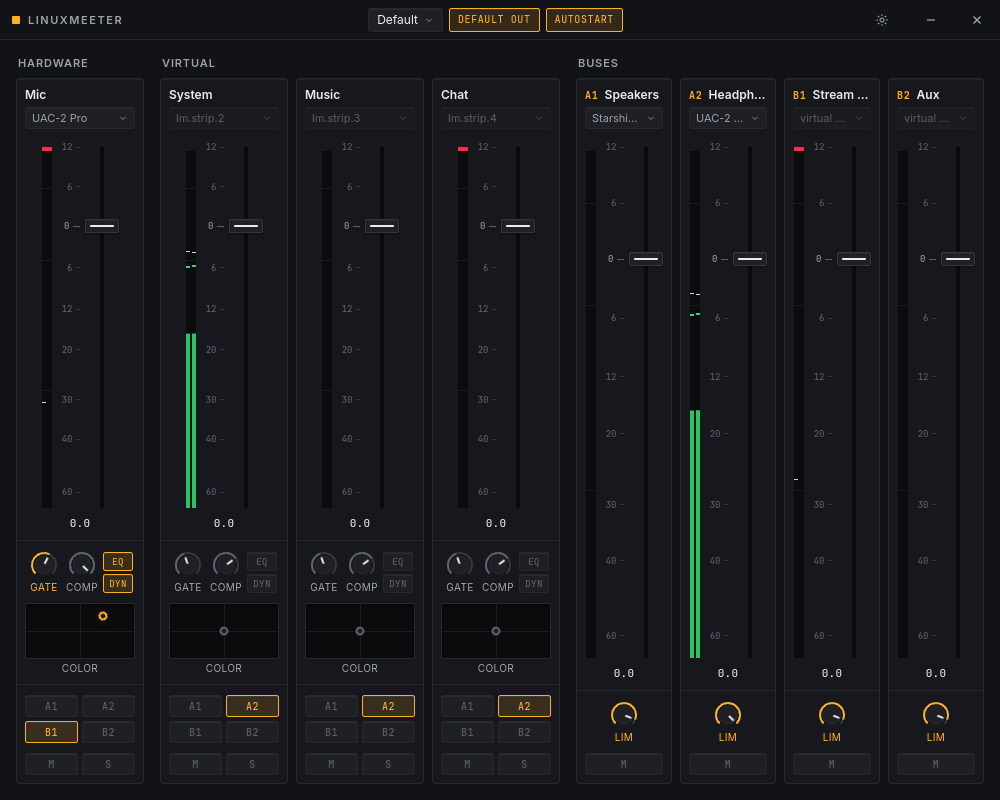
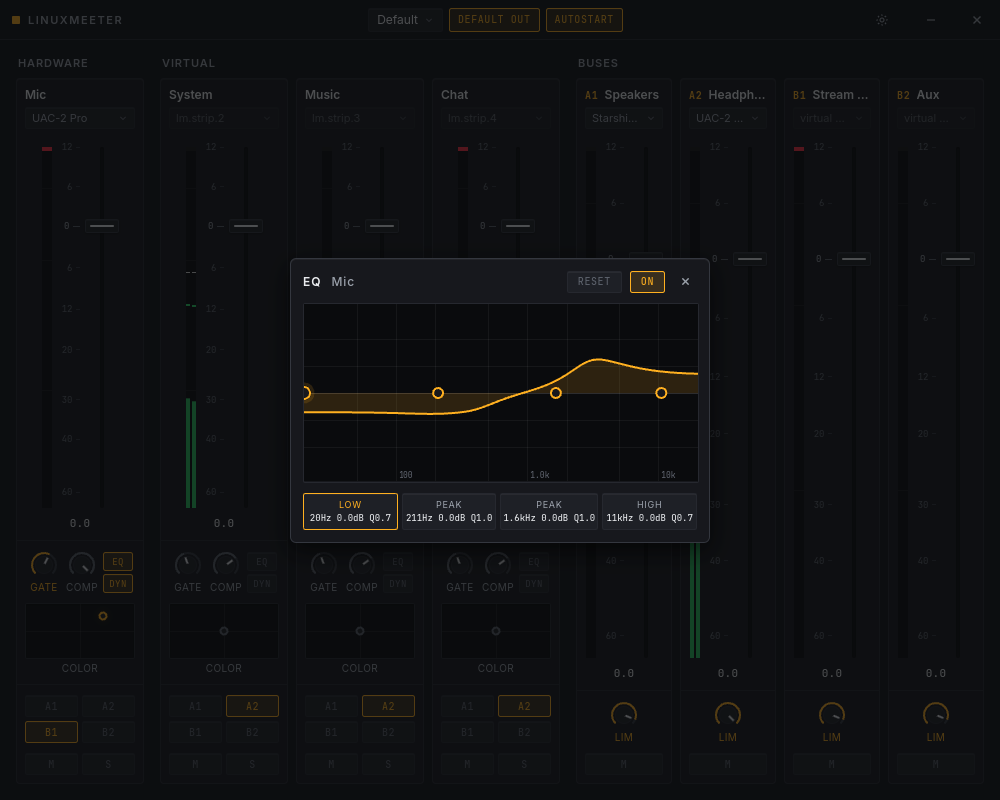
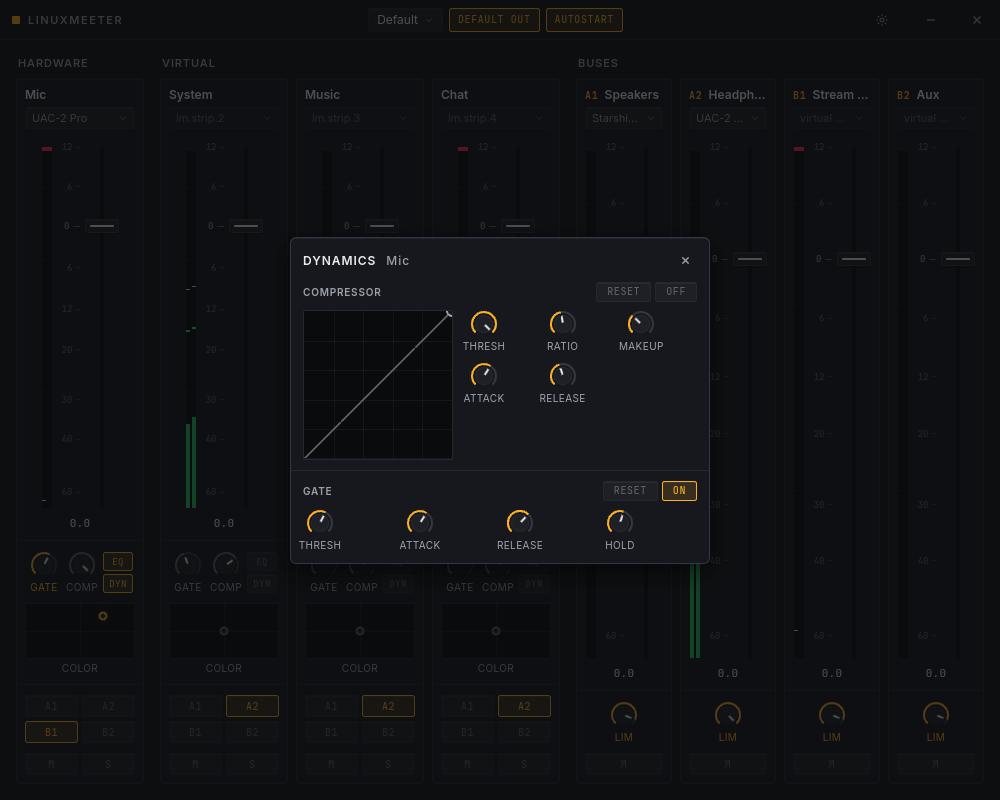

# linuxmeeter

[](https://github.com/dslapelis/linuxmeeter/actions/workflows/ci.yml)
[](https://github.com/dslapelis/linuxmeeter/actions/workflows/packaging.yml)

A VoiceMeeter-style virtual audio mixer for Linux, built natively on
**PipeWire**. Route any app or microphone through gated, compressed, EQ'd
channel strips into hardware outputs and virtual microphones that Discord,
OBS, or any recorder can use.



## Features

- **Input strips** — hardware strips capture real devices (mic, line in);
  virtual strips appear as output devices apps can play into
  (System / Music / Chat out of the box)
- **Per-strip DSP** — gate, compressor (with transfer-curve editor),
  4-band parametric EQ with an interactive response curve, and a
  VoiceMeeter-style **voice color** XY pad — all powered by the
  [LSP](https://lsp-plug.in) LV2 plugins inside PipeWire filter-chains

  

  

- **Output buses** — A1/A2 to hardware devices, B1/B2 as **virtual
  microphones** (post-limiter) selectable in any app
- **Routing matrix** — A1/A2/B1/B2 toggles per strip, applied as live
  PipeWire links; mute/solo; peak/RMS metering with clip latch at 30 fps
- **Default-output takeover** — one click makes the System strip your
  default sink so *all* desktop audio flows through the mixer
- **Profiles** — everything persists to `~/.config/linuxmeeter/` (TOML,
  hand-editable) and restores on launch; tray icon + close-to-tray +
  optional autostart keep your devices alive from login
- **Clean by design** — all virtual devices live in-process and vanish
  completely when the app exits; WirePlumber is never left managing our
  volumes

## Requirements

- PipeWire ≥ 1.0 with WirePlumber (the pulse compatibility layer is used by
  most apps, but linuxmeeter itself talks native PipeWire)
- `lsp-plugins-lv2` (gate/compressor/EQ/limiter DSP)
- `webkit2gtk-4.1`, `gtk3`, `libayatana-appindicator` (UI shell + tray)

## Building

```sh
pnpm install
pnpm tauri dev          # development (mixer runs against your live graph)
pnpm tauri build --no-bundle   # release binary at target/release/linuxmeeter
```

Arch users: see `packaging/PKGBUILD`.

## Development notes

- `pnpm dev` in a plain browser runs the full UI against a **mock backend**
  with simulated meters — the design-iteration environment.
- The workspace splits into `lm-protocol` (shared types), `lm-engine`
  (all PipeWire code, testable headless — see `examples/`), and `src-tauri`
  (shell + IPC).
- `cargo run --example graph -p lm-engine` drives the full audio topology
  from a REPL without the UI.

## License

GPL-3.0-or-later. Bundled fonts (Inter, JetBrains Mono) are under the SIL
Open Font License.
